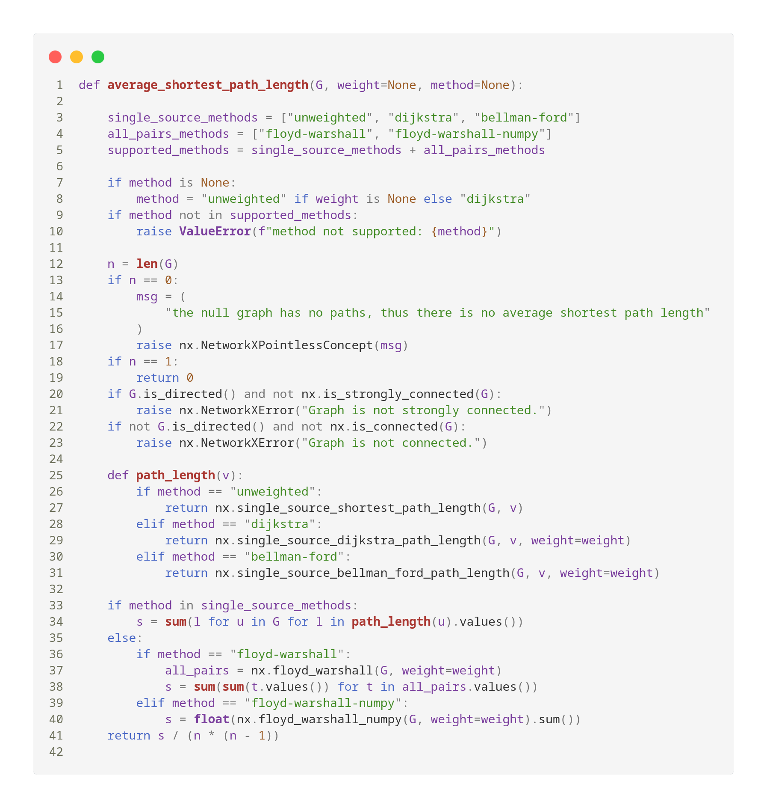
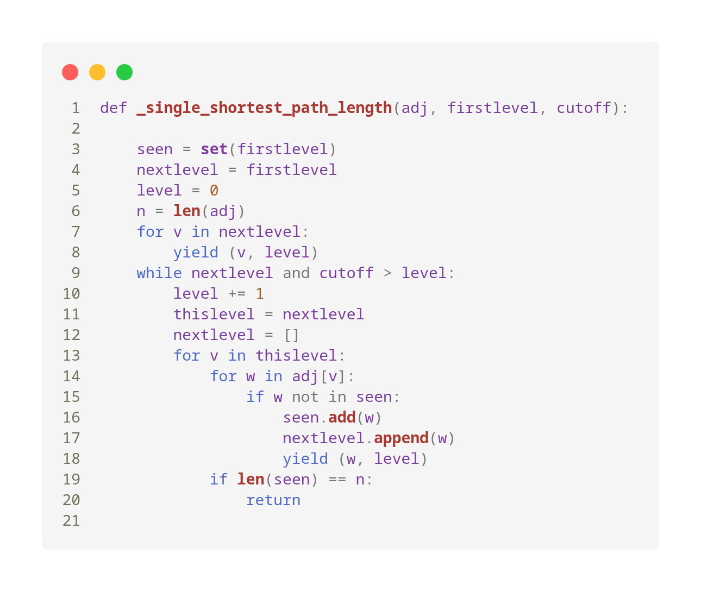
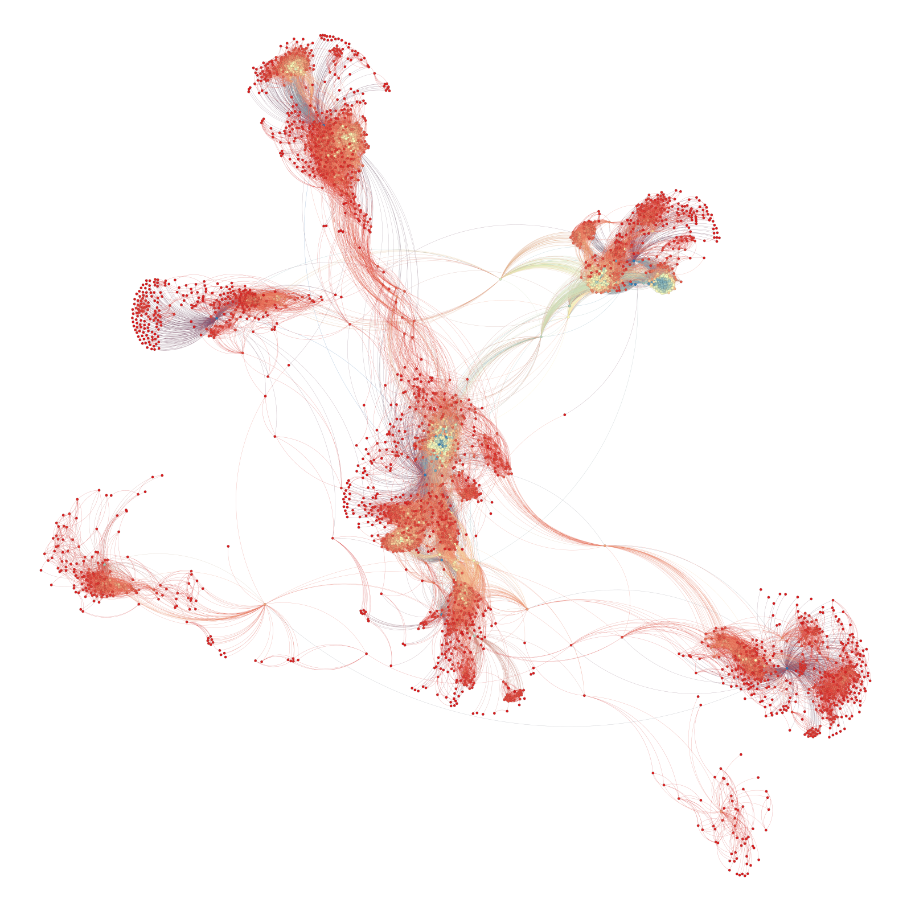
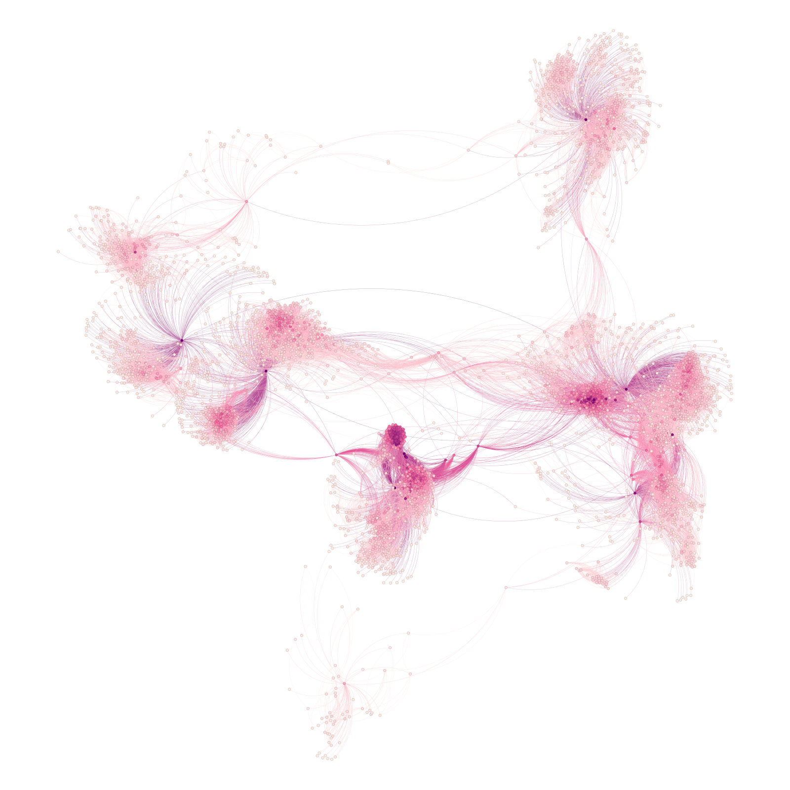

# Análise das Redes Sociais à Luz da Teoria de Grafos

## Sobre o Projeto
Este projeto apresenta uma análise das redes de amizade de 64 estudantes da Universidade Regional do Cariri utilizando conceitos da Teoria de Grafos. O estudo foi realizado com base nas interações desses estudantes no Facebook, com o objetivo de identificar padrões de comportamento social.
- Artigo original: [ANÁLISE DAS REDES SOCIAIS À LUZ DA TEORIA DE GRAFOS DOS ESTUDANTES DE UMA UNIVERSIDADE PÚBLICA](./ANÁLISE%20DAS%20REDES%20SOCIAIS%20À%20LUZ%20DA%20TEORIA%20DE%20GRAFOS%20DOS.pdf)

## Metodologia
Foram analisadas as redes de amizade de estudantes universitários, avaliando diferentes métricas de grafos para entender padrões sociais e como os alunos interagem entre si nas plataformas digitais. A implementação foi feita utilizando a biblioteca `networkx` em Python.

## Resultados Principais
### Facebook
- **Número de nós:** 29.000
- **Conectividade Média:** 64,5774
- **Menor Caminho Médio:** 3,978
- **Observações:**
  - Estudantes de Ciências Sociais possuem redes mais diversificadas.
  - Estudantes das áreas de Artes e Engenharias tendem a se manter em grupos fechados.
  - As redes possuem características de "pequeno mundo".

## Metodologia e Métodos
- Dados extraídos de: [SNAP Stanford](https://snap.stanford.edu/data/)
- Representação dos dados: Matriz de adjacência no formato:
  ```
  0 1
  0 2
  0 3
  0 4
  ...
  ```
- Ferramentas utilizadas:
  - NetworkX para manipulação e análise de grafos.
  - Formato GraphML para armazenamento dos grafos.
  - Gephi para representação gráfica dos grafos

## Execução
- Código implementado em Python com NetworkX:
```python
import networkx as nx

def gerar_dados(G):
    number_of_nodes = G.number_of_nodes()
    number_of_edges = G.number_of_edges()

    degrees = nx.degree(G)
    average_degree = sum(dict(degrees).values()) / number_of_nodes

    average_shortest_path_length = (
        nx.average_shortest_path_length(G)
        if number_of_nodes < 5000
        else "O(n²), não vai rolar"
    )

    return (
        f"Número de nós: {number_of_nodes}\n"
        f"Número de arestas: {number_of_edges}\n"
        f"Conectividade Média: {average_degree}\n"
        f"Menor Caminho Médio: {average_shortest_path_length}\n"
    )


G_facebook = nx.read_edgelist("source_data/facebook_combined.txt", create_using=nx.Graph, nodetype=int)
G_twitter = nx.read_edgelist("source_data/twitter_combined.txt", create_using=nx.Graph, nodetype=int)

nx.write_graphml(G_facebook, "grafo_facebook.graphml")
nx.write_graphml(G_twitter, "grafo_twitter.graphml")

print("Facebook:\n\n" + gerar_dados(G_facebook))
print("Twitter:\n\n" + gerar_dados(G_twitter))
```

## Menor Caminho Médio NetworkX
- **Average Shortest Path Length** 
- **Busca em Largura** 

## Resultados
**Facebook:**
- **Número de nós:** 4039
- **Número de arestas:** 88.234
- **Conectividade Média:** 43,6910
- **Menor Caminho Médio:** 3,6925

### Twitter
- **Número de nós:** 81.306
- **Número de arestas:** 1.342.310
- **Conectividade Média:** 33,0187
- **Menor Caminho Médio:** O(n²), não vai rolar


## Representação Visual
- **Grafo do Facebook** 
- **Grafo do Twitter** 

## Conclusão
A análise revelou padrões de comportamento distintos entre os estudantes de diferentes áreas do conhecimento. As redes sociais analisadas seguem características de redes de pequeno mundo, onde a maioria das conexões estão a poucos graus de separação. 

## Referências
- Dados obtidos de: [SNAP Stanford](https://snap.stanford.edu/data/)
- Implementação baseada na documentação do NetworkX.
- Artigo relacionado: "Análise das Redes Sociais à Luz da Teoria de Grafos".